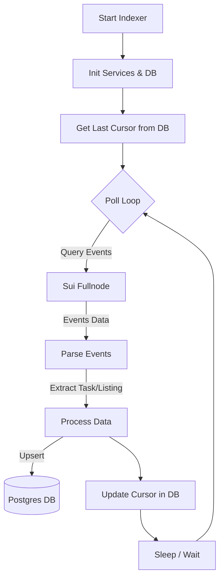
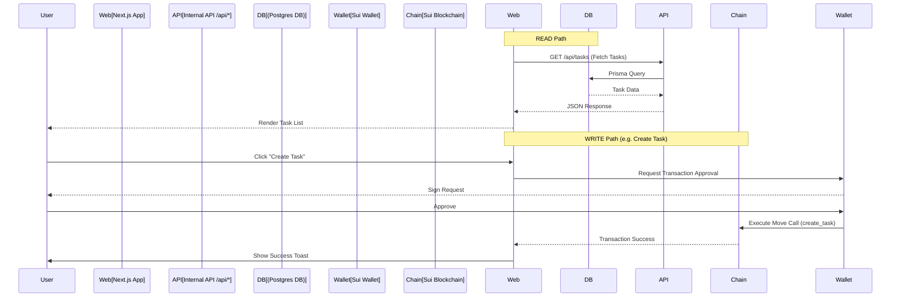
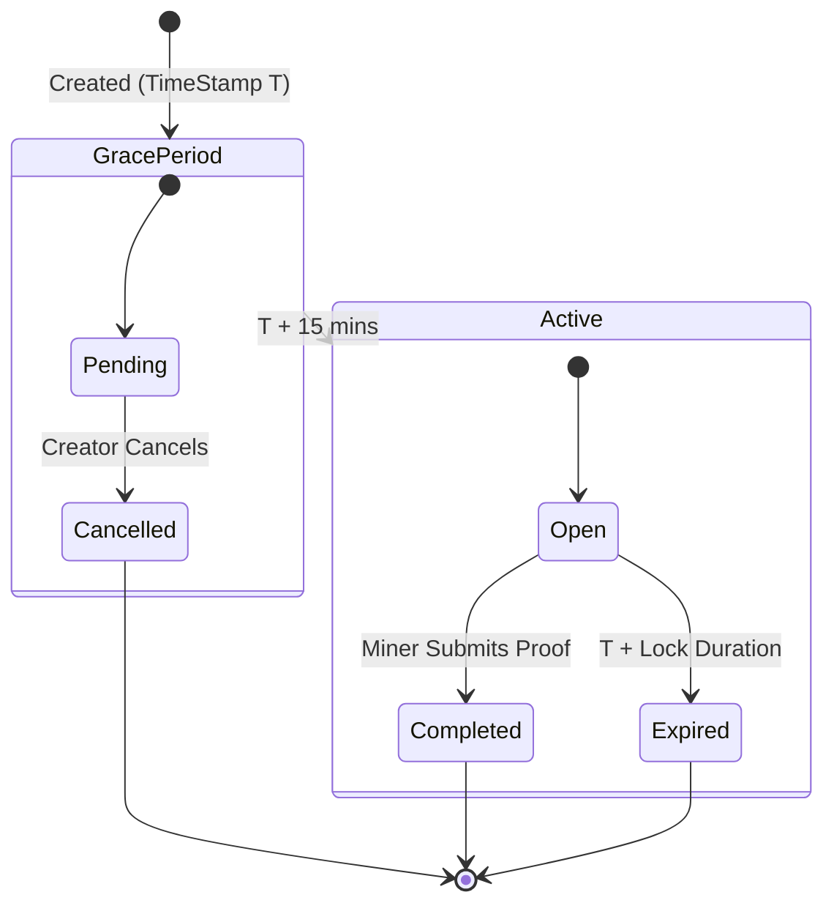

# System Architecture

## 1. Indexer Mechanism

The **Indexer** is a standalone Node.js service responsible for syncing on-chain data to a local PostgreSQL database. It operates by polling the Sui network for events emitted by the `VaniHash` and `Marketplace` packages.

### Indexer Logic Flow

### Data Flow Components

- **SuiService**: Wrapper around SuiClient to query events with pagination.
- **EventParser**: Deserializes raw event JSON into structured data.
- **DbService**: Prisma-based service to update `Task` and `Listing` tables.

---

## 2. Web Application Logic

The **Web App** is a Next.js application that serves as the user interface. It interacts with both the Indexer (via API) for reading data and the Sui Blockchain (via Wallet) for writing data (transactions).

### Data Flow Diagram

### Task Lifecycle State Machine

The lifecycle of a Task involves interactions between the Creator, the Miner, and the System (time).

