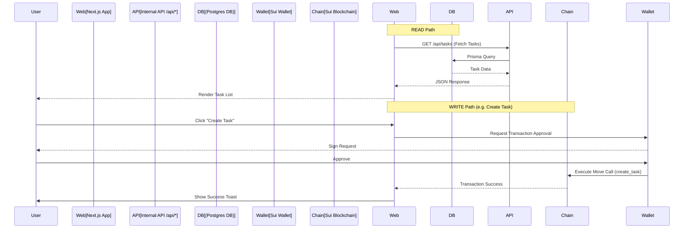
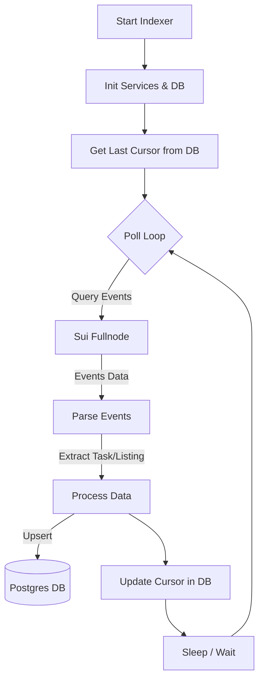
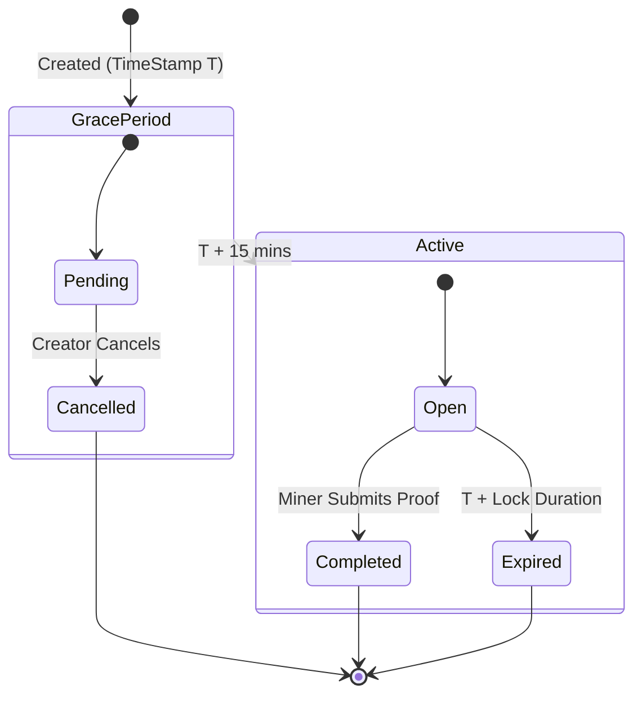

# VaniHash - Decentralized Vanity Task Marketplace

**VaniHash** is a decentralized Task Marketplace built on the Sui blockchain. It connects creators who need custom **Vanity Object & Package IDs** with miners who use computational power to generate them.

Whether you need a memorable address for a new Move Package (e.g., `0xc0de...cafe`) or a unique Object ID for a special NFT, VaniHash streamlines the process through a trustless, verifiable Proof-of-Work protocol.

## 🔗 Links
- **Live Demo**: [vani-hash.vercel.app](https://vani-hash.vercel.app/)
- **Video Demo**: [Watch on YouTube](https://youtu.be/SVllDADVxiE)

---

## 🏆 Hackathon Track
**Category**: **Sui Track**
*Building an innovative application with great "Vibe" on Sui.*

---

## ✨ Key Features

- **Dual Vanity Support**: Request specific prefixes for both **Move Packages** and **General Objects**.
- **Decentralized Mining Protocol**: Miners compete to find the cryptographic "salt" that generates the target ID.
- **Verifiable Results**: Smart contracts mathematically verify the submitted salt on-chain before releasing rewards.
- **Secure Submission**: Trustless claiming process ensuring miners get paid for valid work.
- **Real-Time Indexer**: A robust indexing service tracks tasks, mining solutions, and marketplace activity instantly.

---

## 🏗 System Architecture

### 1. Web Application Logic
The **Web App** (Next.js) serves as the interface for Creators to post tasks and Miners to browse them. It reads data from our Indexer API and writes to the blockchain via the user's wallet.



### 2. Indexer Mechanism
The **Indexer** is a standalone Node.js service that syncs on-chain data to a local PostgreSQL database by polling the Sui network for events emitted by `VaniHash` and `Marketplace` packages.



### 3. Task Lifecycle
The state machine below illustrates the lifecycle of a Task from creation to completion or expiration.



---

## 🛠 Tech Stack

- **Smart Contracts**: Sui Move 2024
- **Frontend**: Next.js 16 (App Router), React 19, Tailwind CSS 4
- **Indexer**: Node.js, `@mysten/sui` SDK
- **Database**: PostgreSQL, Prisma ORM

---

## 🚀 Getting Started

### Prerequisites
- Node.js (v20+)
- Sui Client CLI
- PostgreSQL Database (Supabase recommended)

### Directory Structure
The project uses a **single global Prisma schema** located at `./prisma/schema.prisma`.

```text
/VaniHash
  ├── prisma/
  │    └── schema.prisma   <-- Single source of truth
  ├── web/                 <-- Next.js App
  └── indexer/             <-- Node.js Service
```

### Installation Steps

#### 1. Deploy Smart Contracts
Deploy the Move packages found in the `contracts/` directory.

```bash
# Deploy VaniHash Core
cd contracts/vanihash/
sui move build
sui client publish --gas-budget 100000000

# Deploy Marketplace Logic
cd ../marketprice
sui move build
sui client publish --gas-budget 100000000
```

#### 2. Run Web Application
```bash
cd web
npm install
npx prisma generate --schema=../prisma/schema.prisma --generator client_web
npm run dev
# Access at http://localhost:3000
```

#### 3. Run Indexer Service
```bash
cd indexer
npm install
npx prisma generate --schema=../prisma/schema.prisma --generator client_indexer
npm run start
```

---

## 🤖 AI Tool Disclosure

This project was developed with the assistance of the following AI tools in accordance with the Hackathon rules:
- **Tools**: Google Gemini, Antigravity Agent.
- **Usage**: Code generation for boilerplate, architectural planning (Mermaid diagrams), debugging Move contracts, and optimizing React components.
- **Key Prompts**: "Refactor marketplace indexing", "Fix Move visibility error", "Implement vanilla CSS styling for components".

---

## 📄 License
MIT License